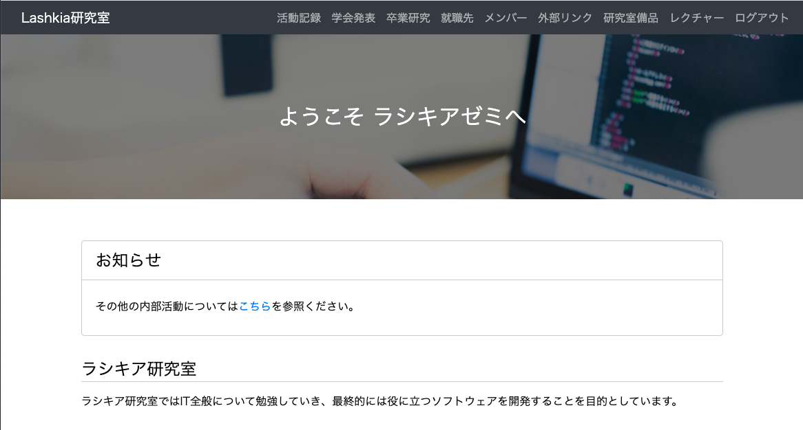

# semi homepage

## 概要

[ラシキアゼミのホームページ](http://www.lanet.sist.chukyo-u.ac.jp/)。Railsからgolangへ書き換えやwiki,管理ドキュメントの作成などを行った。

## 機能

- ホームページ
    - 活動記録・学会発表などの閲覧
- 管理者ページ
    - リソース管理

## 管理者へ

実装・開発環境については[wiki](https://github.com/LashkiaSemi/HomePage/wiki)を参考にしてください。(気が向いてる時に作ってます)
管理については、別にドキュメントがあるので、そちらを参考にしてください。